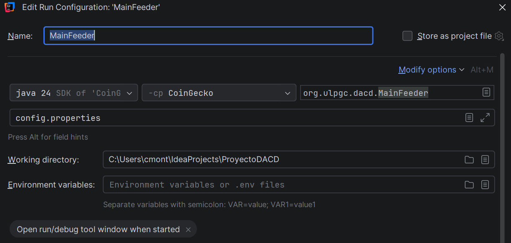
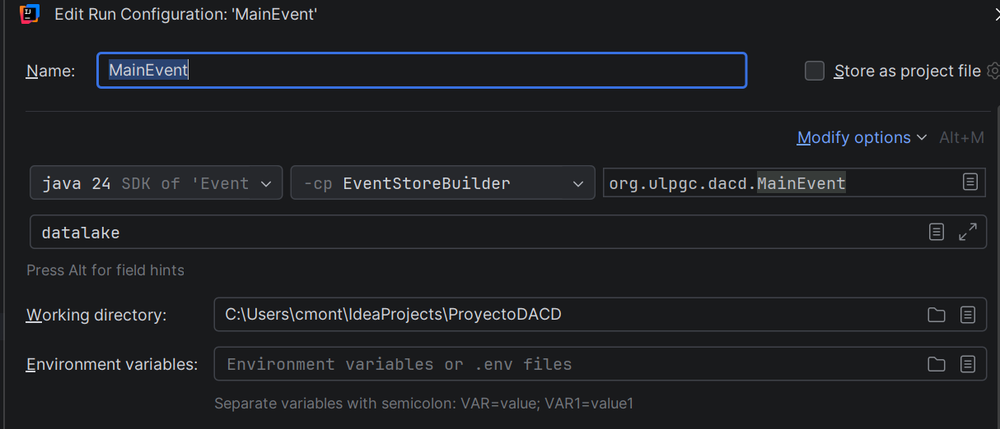
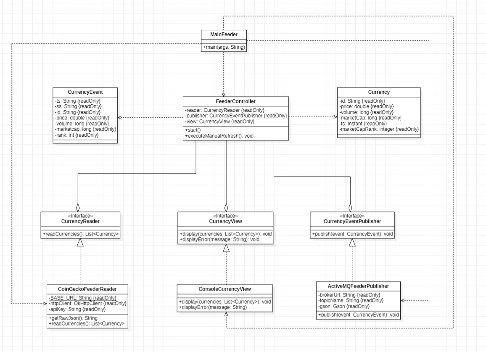
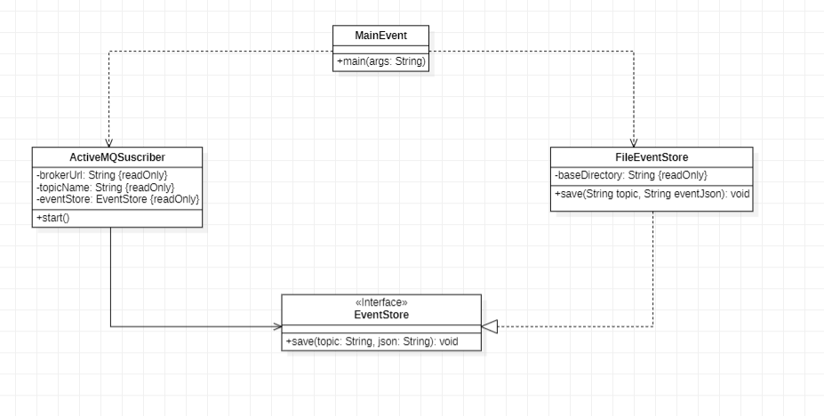
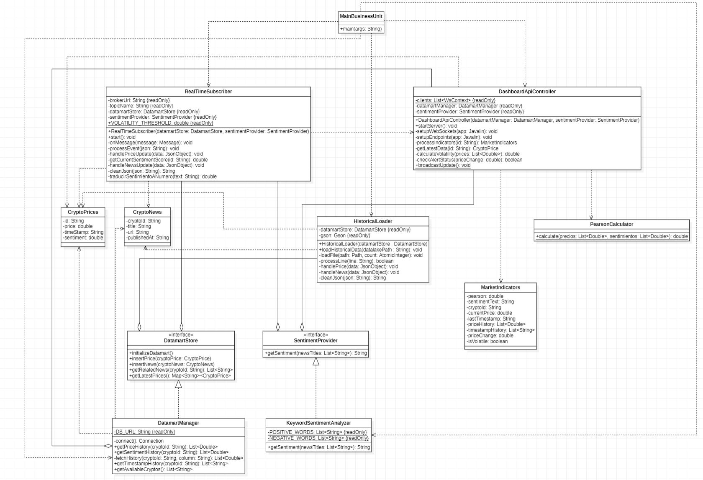
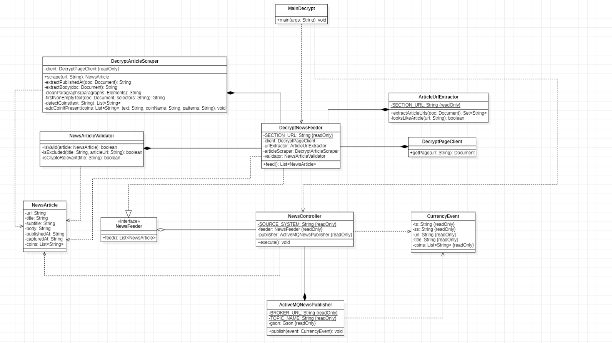
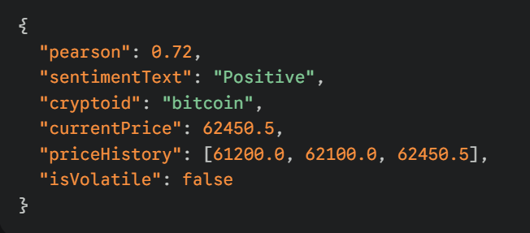

# Crypto Monitor

## 1. Descripción del Proyecto

Este proyecto consiste en el desarrollo de una plataforma avanzada de monitorización
de criptomonedas en tiempo real, diseñada bajo una Arquitectura Lambda para el procesamiento 
masivo de datos. El sistema integra tres flujos de información críticos:

    1. Ingesta de Precios: Captura automática de cotizaciones de las principales criptomonedas a través de la API de CoinGecko.
    
    2. Web Scraping de Noticias: Recolección de artículos de prensa especializada (Decrypt) para identificar eventos que impacten el mercado.

    3. Persistencia y Análisis: Un motor de almacenamiento de eventos (Datalake) y una unidad de negocio que unifica datos históricos y en tiempo real en un Datamart persistente (SQLite).

    4. Correlación Estadística: Implementación del Índice de Pearson para medir la relación entre el sentimiento de las noticias y el movimiento del precio.

## 2. Propuesta de Valor

La principal ventaja competitiva de esta herramienta no es solo la visualización de datos, sino la generación de 
conocimiento accionable para el usuario:

    - Correlación de Pearson (Sentimiento vs. Precio): A diferencia de los monitores convencionales, el sistema implementa el Índice de Pearson (r) en tiempo real. Esto permite al usuario cuantificar matemáticamente la fuerza de la relación entre el sentimiento de las noticias y la fluctuación del mercado, identificando de forma objetiva anomalías o divergencias de precio.

    - Análisis de Sentimiento Automatizado: Mediante un motor de procesamiento de lenguaje natural basado en heurística de palabras clave, la plataforma categoriza el impacto emocional del flujo de noticias. Esto permite filtrar el "ruido" del mercado y centrarse en eventos con una carga sentimental alta (alcista o bajista).

    - Resiliencia y Sincronización: El sistema garantiza la integridad absoluta del historial de mercado. Gracias al uso de suscriptores duraderos en el middleware (ActiveMQ), la plataforma es capaz de realizar una lógica de catch-up automático. Si el sistema se desconecta, al reiniciarse procesa instantáneamente todos los eventos acumulados, eliminando cualquier brecha de información en el Datamart.

    - Implementación de Arquitectura Lambda: El diseño combina un flujo de procesamiento por lotes (Batch) para el análisis de datos históricos masivos con un flujo de velocidad (Speed Layer) para la respuesta inmediata. El resultado es una transición fluida donde el usuario puede analizar tendencias pasadas y movimientos en vivo bajo un mismo modelo de datos unificado.

    - Alertas de Volatilidad Contextualizadas: El sistema no solo avisa cuando el precio cambia, ofrece el porqué. Al detectar variaciones superiores al umbral configurado, la plataforma vincula automáticamente el movimiento con la última noticia relevante y su puntuación de sentimiento, reduciendo drásticamente el tiempo de reacción del analista.

    - Visualización Analítica de Alta Densidad (Dashboard Real-Time): El sistema traslada la complejidad del procesamiento de datos a una interfaz web intuitiva y dinámica. Mediante el uso de WebSockets y actualizaciones reactivas, el Dashboard ofrece una supervisión manos libres donde widgets especializados (velocímetros de Pearson, indicadores de sentimiento y gráficos de tendencia) se sincronizan al milisegundo con los eventos del mercado. Esta capacidad permite al usuario detectar patrones visuales de forma inmediata sin necesidad de interactuar manualmente con la plataforma.

## 3. Justificación de Tecnologías y Estructura de Datamart

### 3.1. Elección de Fuentes de Datos (APIs y Scraping)

    - CoinGecko API: Se seleccionó por ser una de las fuentes más fiables y completas en el sector cripto. Su campo last_updated permite una sincronización precisa con el mercado, evitando procesar datos obsoletos si la cotización no ha variado.

    - Scraping de Decrypt: Se eligió esta fuente de noticias por su enfoque técnico y la estructura clara de sus artículos (título, cuerpo y fecha de publicación). Esto facilita la extracción de metadatos críticos para el análisis de sentimiento y la vinculación con activos específicos

### 3.2. Estructura del Datamart (SQLite)

El Datamart ha sido diseñado siguiendo principios de normalización para garantizar la consistencia entre el flujo de precios y el de noticias, permitiendo una analítica cruzada eficiente.

#### Modelado de Datos

    - Tabla de Precios (prices): Almacena el histórico de cotizaciones, incluyendo el timestamp preciso y la métrica de sentimiento calculada en el momento de la ingesta. Esto permite reconstruir la evolución del mercado con contexto emocional.

    - Tabla de Noticias (news): Almacena el contenido informativo. Se utiliza una Clave Primaria Compuesta para asegurar la unicidad, evitando que una misma noticia procesada por diferentes fuentes duplique el ruido en el análisis.

#### Estrategias de Optimización e Integridad

    - Persistencia Robusta: El uso de SQLite garantiza que el estado de la Business Unit sea persistente. Tras un reinicio, el sistema puede recuperar instantáneamente los últimos estados para reanudar el cálculo del Índice de Pearson sin tiempos de espera.

    - Resolución de Conflictos (INSERT OR IGNORE): Se implementa una lógica de inserción no bloqueante. El sistema descarta automáticamente registros duplicados a nivel de base de datos, lo que optimiza el ciclo de escritura y garantiza que el Datalake y el Datamart mantengan una sincronía limpia.

    - Eficiencia en Consultas de Ventana: La estructura de índices permite realizar consultas de ventana deslizante con latencia mínima. Esto es crítico para que el Dashboard recalcule la volatilidad y los promedios móviles en tiempo real cada vez que el broadcastUpdate() se activa.

#### Relación Semántica

    - El diseño permite realizar vínculos temporales: El sistema busca noticias cuya publicación coincida con ventanas de volatilidad detectadas. Esto permite la contextualización automática en la interfaz web, explicando al usuario el "porqué" de un movimiento de mercado mediante el cruce de datos de ambas tablas.

## 4. Instrucciones claras para compilar y ejecutar cada módulo

### 4.1. Requisitos Previos

    - Java 21 o superior instalado.

    - Maven instalado para la gestión de dependencias y construcción de los JARs.

    - Apache ActiveMQ en ejecución (por defecto en tcp://localhost:61616).

    - API Key de CoinGecko: Es necesario disponer de una clave de la API de CoinGecko.

### 4.2. Configuración Inicial

Antes de ejecutar los módulos, es obligatorio crear un archivo llamado **config.properties** en la raíz del proyecto
con el siguiente contenido:

Dicho archivo tendrá que ser pasado por argumento al mainFeeder.

    # ProyectoDACD/config.properties
    api.key=TU_API_KEY_AQUI

Debes definir una ruta en tu sistema de archivos (**datalake**) donde se almacenarán los eventos en formato NDJSON.

    Esta misma ruta debe ser proporcionada como argumento tanto al EventStoreBuilder para la escritura, como a la BusinessUnit para la carga del histórico.

    El sistema creará automáticamente la estructura interna de carpetas (/events/topic/source/) dentro de esta ruta al recibir los primeros mensajes.

### 4.3. Orden de Ejecución

Para asegurar la correcta persistencia y visualización de los datos, se recomienda seguir estrictamente este orden:

    1. Event Store Builder (MainEvent): Debe ser el primero en arrancar para que el Datalake esté listo para guardar los eventos que generen los siguientes módulos.

        Argumento: Ruta absoluta o relativa de la carpeta del datalake.

    2. Business Unit (MainBusinessUnit): Al arrancar, realizará la carga histórica del datalake y activará la interfaz gráfica y la escucha en tiempo real.

        Argumento: Ruta de la carpeta del datalake (debe coincidir con la del MainEvent).

    3. Decrypt Scraper (MainDecrypt): Ejecutarlo a continuación para que capture las noticias más recientes 

    4. CoinGecko Feeder (MainFeeder): Una vez que todo el sistema de persistencia y análisis está activo, iniciamos el feeder para empezar a recibir las cotizaciones en vivo.

## 5. Arquitectura de sistema y arquitectura de la aplicación.

### 5.1 Arquitectura del Sistema

El sistema sigue un patrón de Arquitectura Lambda, diseñado para procesar grandes volúmenes de datos aprovechando tanto el procesamiento por lotes (batch) como en tiempo real (speed layer).
    
#### 1. Batch Layer (Capa de Lote)

Esta capa se encarga de la persistencia inmutable de todos los eventos que llegan al sistema.

    - Componente: EventStoreBuilder.

    - Función: Suscribe al bus de mensajes (ActiveMQ) y almacena cada evento (precio o noticia) en un sistema de archivos organizado por origen y fecha (Datalake).

    - Recuperación: Permite reconstruir el estado del sistema desde cero en caso de fallo o necesidad de re-procesamiento mediante el HistoricalLoader.

#### 2. Speed Layer (Capa de Velocidad)

Procesa los datos en cuanto llegan para ofrecer una latencia mínima.

    - Componente: RealTimeSubscriber (dentro de la BusinessUnit).

    - Función: Consume mensajes del tópico prediction.crypto en tiempo real.

    - Acción: Calcula el sentimiento al vuelo y actualiza el Datamart de forma inmediata para que el usuario vea los cambios sin retraso.

#### 3. Serving Layer (Capa de Servicio)

Expone los datos procesados para su consulta.

    - Componente: DashboardApiController.

    - Tecnología: Servidor Javalin con soporte para WebSockets.

    - Función: Combina los datos históricos y en tiempo real para calcular indicadores como el Índice de Pearson y servirlos mediante una API REST y notificaciones push.

### 5.2 Arquitectura de la Aplicación

#### 1. Feeder (CoinGecko)

    - Extrae precios en tiempo real de la API de CoinGecko.

    - Inyecta las dependencias necesarias (Reader, Publisher, View) desde su Main.

#### 2. Scraper (Decrypt)

    - Realiza Web Scraping de noticias cripto del portal Decrypt.

    - Valida y publica las noticias en el bus de mensajes.

#### 3. Event Store

    - Actúa como el guardián de los datos brutos, asegurando que nada se pierda en el Datalake.

#### 4. Business Unit

    - El núcleo analítico. Gestiona la base de datos SQLite (Datamart), calcula sentimientos y correlaciones, y ofrece la interfaz visual.

### 5.3 Diagramas de Clases

#### 1. Diagrama del Feeder

#### 2. Diagrama MainEvent

#### 3. Diagrama MainBusinessUnit

#### 4. Diagrama MainDecrypt

## 6. Tecnologías Utilizadas

Este proyecto integra diversas tecnologías para cubrir todo el ciclo de vida del dato, desde la ingesta hasta la visualización.

### Lenguajes y Entorno

    - Java 21+: Lenguaje principal de desarrollo, utilizando características modernas como Records para definir entidades de datos de forma concisa.

    - Maven: Motor de construcción y gestión de dependencias para todos los módulos del proyecto.

    - HTML/CSS/JavaScript: Tecnologías base para el desarrollo del dashboard visual.

### Comunicación y Mensajería

    - Apache ActiveMQ: Broker de mensajería utilizado para el paso de mensajes asíncrono entre módulos. Implementa un modelo de Publicación/Suscripción (Topic) para distribuir precios y noticias.

### Almacenamiento de Datos

    - SQLite (JDBC): Base de datos relacional ligera utilizada en el Datamart de la BusinessUnit para almacenar el estado procesado del sistema.

    - Sistema de Archivos (Datalake): Almacenamiento inmutable en formato .events para persistir todos los eventos brutos recibidos, permitiendo el re-procesamiento histórico.

### Frameworks y Librerías de API

    - Javalin: Framework web ligero para Java utilizado para crear la API REST y gestionar las conexiones WebSockets en tiempo real.

    - Gson (Google): Librería para la serialización y deserialización de objetos Java a formato JSON, esencial para el intercambio de mensajes y almacenamiento de eventos.

### Visualización y Análisis

    - WebSockets: Protocolo utilizado para la comunicación bidireccional entre el servidor y el navegador, permitiendo actualizaciones instantáneas en el dashboard.

    - Lógica Estadística: Implementación personalizada del Índice de Correlación de Pearson para analizar la relación entre el sentimiento de las noticias y el precio de las criptomonedas

### Como se conectan

    1. El Feeder y el Scraper generan eventos en Java y los envían a ActiveMQ en formato JSON mediante Gson.

    2. El Event Store escucha estos mensajes y los guarda físicamente en el Datalake.

    3. La Business Unit consume los mensajes de ActiveMQ, realiza cálculos de sentimiento y persiste los resultados en SQLite.

    4. Finalmente, Javalin sirve esos datos a través de una API, y mediante WebSockets avisa al frontend para que se actualice sin refrescar la página.

## 7. Principios y Patrones de Diseño Aplicados

El desarrollo de este sistema se ha fundamentado en estándares de ingeniería de software para asegurar un código mantenible, escalable y robusto.

### Principios de SOLID

    - Responsabilidad Única: Cada clase y módulo aborda una única razón para cambiar. Por ejemplo, el Feeder solo gestiona la obtención de datos, mientras que el EventStore se dedica exclusivamente a la persistencia inmutable en el Datalake.

    - Abierto/Cerrado: El sistema permite extender funcionalidades sin modificar el código existente. Gracias al uso de interfaces, se pueden añadir nuevos proveedores de sentimiento o fuentes de datos sin alterar la lógica de los suscriptores.

    - Inversión de Dependencias: Los módulos de alto nivel (como los controladores) no dependen de implementaciones concretas, sino de abstracciones (interfaces). Se aplica Inyección de Dependencias a través de los constructores para facilitar el desacoplamiento

    - Segregación de Interfaces: Se han definido interfaces específicas y pequeñas, como DatamartStore o SentimentProvider, evitando obligar a las clases a implementar métodos que no necesitan.

### Patrones de Diseño

    - Observer (Publish-Subscribe): Implementado a través de ActiveMQ. Define un mecanismo donde múltiples consumidores (Business Unit, Event Store) se suscriben a un tema para recibir notificaciones sobre nuevos eventos de un objeto observado (el Feeder/Scraper).

    - Strategy: Las interfaces como SentimentProvider permiten intercambiar algoritmos de análisis (como el KeywordSentimentAnalyzer) de forma transparente para el cliente que las utiliza.

    - Event Sourcing: En lugar de almacenar solo el estado final, el sistema registra toda la serie de eventos en un almacén de solo adición. Esto permite la reconstrucción completa del estado del sistema desde cero a partir del historial de eventos.

### Estilo Arquitectónico: Model-View-Controller (MVC)

Se ha aplicado el patrón MVC de forma integral en los cuatro módulos del sistema para garantizar la separación de intereses y facilitar la evolución independiente de cada componente

#### Model

Contiene la funcionalidad principal, las reglas de dominio y los datos.

    - Feeders (CoinGecko/Decrypt): Representado por los records inmutables de precios y noticias que capturan la realidad del mercado.

    - Business Unit: Gestionado por el DatamartManager, que estructura la información procesada para su consulta.

#### View

Responsable de la representación de la información al usuario o al sistema.

    - Feeders y Event Store: Utilizan una Vista Pasiva mediante la consola o logs del sistema. Esto elimina dependencias mutuas y asegura que la lógica de aplicación no se vea afectada por la forma en que se muestran los mensajes de estado.

    - Business Unit: La vista reside en el frontend web (index.html), encargada de recolectar y mostrar la información procesada mediante gráficas dinámicas.

#### Controller

Maneja la entrada, coordina la comunicación y ejecuta la lógica de aplicación.

    - Feeders (CoinGecko/Decrypt): Los controladores orquestan la lectura de las fuentes y la publicación en el bus de mensajes.

    - Event Store: El suscriptor de ActiveMQ actúa como controlador de persistencia, capturando eventos y dirigiendo su escritura en el almacén de solo adición.

    - En Business Unit: Está compuesto por tres controladores especializados que inyectan o consultan datos en el modelo

        - RealTimeSubscriber: Controlador de ingesta en tiempo real. Escucha el bus de mensajes y decide qué datos deben persistirse en el Datamart.

        - HistoricalLoader: Controlador de carga por lotes (Batch). Orquesta el traspaso masivo de información desde el Datalake hacia el Datamart al inicio del sistema.

        - DashboardApiController: Controlador de interfaz y API. Gestiona las peticiones HTTP del usuario y coordina la actualización de la vista mediante WebSockets.

### Clean Code y Modelado

    - Objetos Inmutables (Records): Se utilizan records de Java para entidades como CryptoPrice y CryptoNews. Estos objetos son inmutables por definición, lo que garantiza seguridad en hilos y facilita las pruebas al tener un estado invariable.

    - Nombres Significativos: Las variables, clases y métodos siguen una nomenclatura que explica por sí misma su intención, evitando prefijos innecesarios y manteniendo la consistencia en todo el proyecto.

    - Funciones Pequeñas y Especializadas: Los métodos en clases como HistoricalLoader están divididos en tareas pequeñas con una única responsabilidad, facilitando su lectura de arriba hacia abajo como una narrativa.

    - Separación de Comando y Consulta: Se procura que las funciones modifiquen el estado o retornen información, pero no ambas cosas simultáneamente, para mejorar la predictibilidad del código.

## 8. Ejemplos de Uso

### 8.1. Dashboard en Tiempo Real

Una vez iniciados todos los módulos, el sistema es accesible a través del navegador

    - URL: http://localhost:7070

    - Funcionamiento: La vista utiliza WebSockets para recibir notificaciones del DashboardApiController. Al recibir un evento, el dashboard se actualiza automáticamente sin necesidad de refrescar la página, mostrando gráficas de precio, indicadores de sentimiento y el cálculo de Pearson.

### 8.2 EndPoints de la API

El controlador expone los siguientes puntos de acceso para la consulta de información procesada

    - Get: /api/monedas | /api/noticias/{id} | /api/indicadores/{id}

Ejemplo de respuesta (JSON) para /api/indicadores/bitcoin

